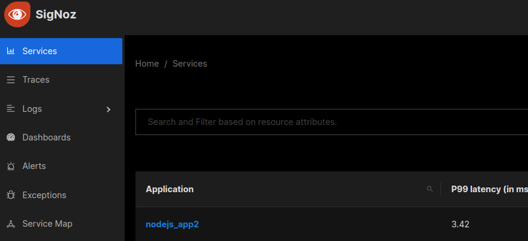
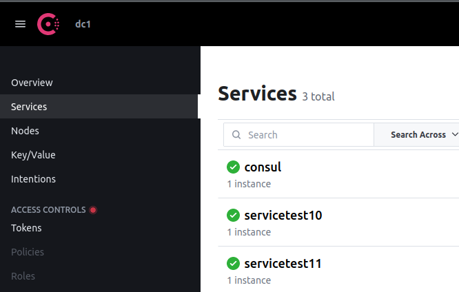

# Consul nodejs with Opentelemetry playground

Este payground usa o Consul k/V e service discovery em microserviços nodejs.
Também usa o OpenTelemetry para enviar os dados para o SigNoz.

O microserviço está nos arquivos index.js de cada serviço.

Já a configuração Opentelemetry está nos arquivos tracing.js de cada serviço.

### Instruções de execução:

Neste diretório Consul-nodejs-opentelemetry:

Execute o seguinte comando em um terminal Linux, para iniciar o SigNoz:

* **_docker compose -f clickhouse-setup/docker-compose.yaml up_**

Em outro terminal Linux, execute o comando para iniciar o Consul:

* **_docker compose up_**

Em outro terminal Linux, entre no diretório ***nodejs-aap1*** e execute so comandos para iniciar o ***app1***:

* **_npm install_**

* **_node -r ./tracing.js index.js_**

Em outro terminal Linux, entre no diretório ***nodejs-aap2*** e execute so comandos para iniciar o ***app2***:

* **_npm install_**

* **_node -r ./tracing.js index.js_**

### Uso:

* Acesse o Sinoz em: http://localhost:3301/

Pode ser necessário cadastrar um usuário e senha no primeiro login do SigNoz.

* Acesse o Consul em: http://localhost:8500

* Acesse o App1 em: http://localhost:5555

* Acesse o App2 em: http://localhost:5556

* Acesse o KV do Consul pelo App1 em: http://localhost:5555/key

* Acesse o KV do Consul pelo App2 em: http://localhost:5556/key

* Acesse todos os serviços do Service discovery do Consul pelo App1 em: http://localhost:5555/services

* Acesse o endereço do App2 pelo Service discovery do Consul pelo App1 em: http://localhost:5555/service11

* Acesse o endereço do App1 pelo Service discovery do Consul pelo App2 em: http://localhost:5556/service10

* Endpoints para teste de Erro para depois serem visualizados no SigNoz. 404: http://localhost:5555/404 e http://localhost:5556/404

### Referências

* OpenTelemetry Setup in a Nodejs Application: 

    https://signoz.io/opentelemetry/nodejs/

* Install SigNoz Using Docker Compose:
  
    https://signoz.io/docs/install/docker

* Consul npm documentation:

  https://www.npmjs.com/package/consul#documentation